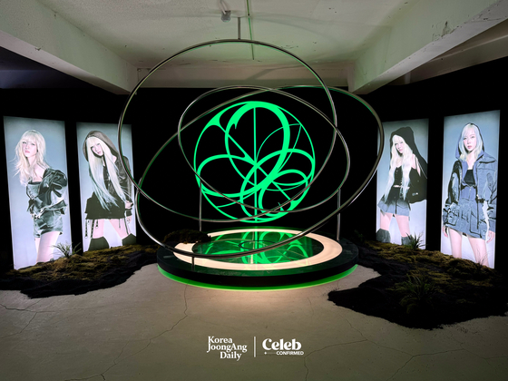
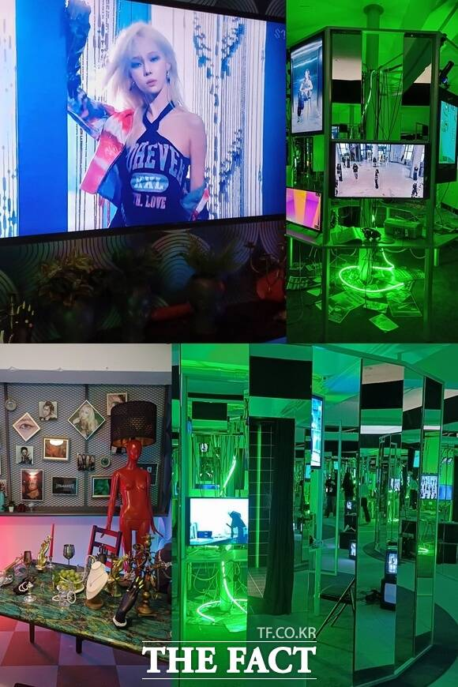
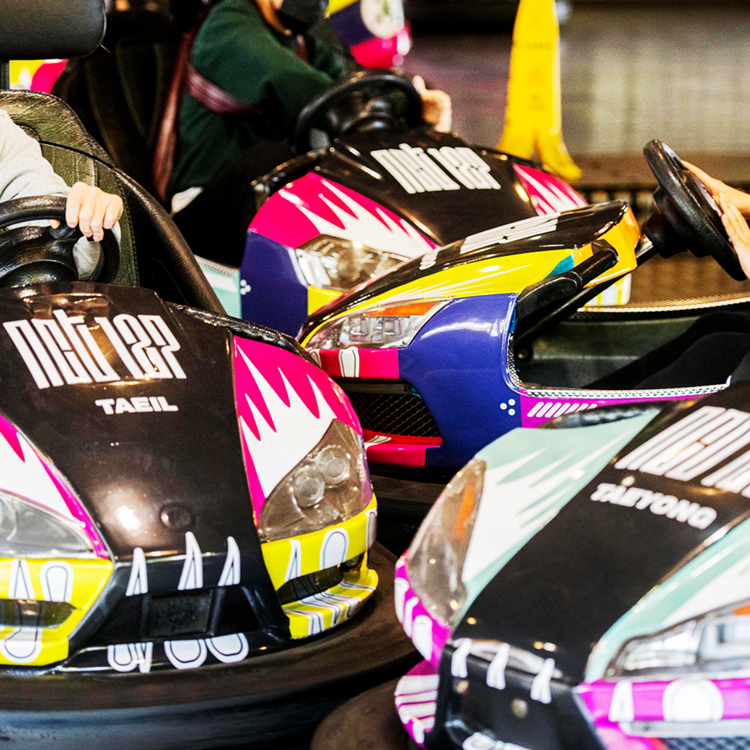
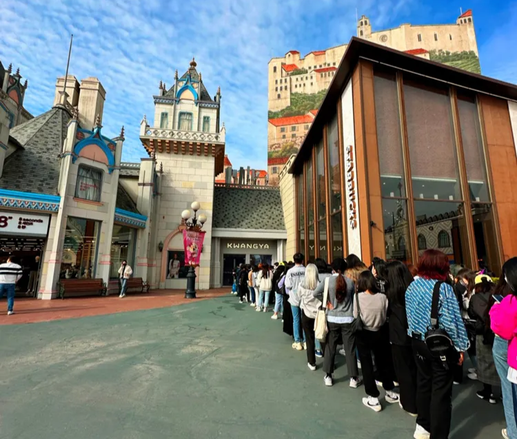

# 수백만이 다녀갔지만 적자였던 아티움, 짧게 열고 다 팔아버린 팝업

K-POP 산업에서 오프라인 공간은 단순한 굿즈 판매장이 아닙니다.

팬들이 브랜드 안에서 ‘살아볼 수 있는’ 몰입의 무대이자, 감정적 유대가 실제 경험으로 전환되는 접점입니다.

SM엔터테인먼트는 그 가능성을 가장 먼저 실험한 기업 중 하나입니다.

**SMTOWN@코엑스아티움**을 통해 팬 경험 중심의 공간 전략을 실행했고, 그로부터 많은 인사이트를 얻었습니다.

---

### 🧩 SMTOWN@코엑스아티움이 남긴 전략 자산

앞선 글(1편)에서 살펴보았듯, 코엑스 아티움은 다음과 같은 전략을 통해 팬의 몰입을 설계했습니다.

- **희소성과 독점성**을 강조한 체험 구성
- **아티스트 흔적**을 활용한 감정적 연결
- **SNS 확산을 유도하는 포토존 설계**
- **팬클럽 중심 멤버십 운영을 통한 결속 강화**

비록 수익성 면에서는 제한적이었지만, 이 프로젝트는 **팬 공간 설계의 정서적·기술적 기준을 축적하는 데 있어 중요한 전환점**이었습니다.

그리고 이 학습은 이후 더욱 민첩하고 수익성 높은 공간 전략으로 이어졌습니다.

---

## ✨ 공간 전략의 진화: ‘팝업스토어’로 이어진 몰입 설계

SM은 코엑스 아티움에서 얻은 경험을 바탕으로 보다 효율적이고 집중적인 형태의 팬 경험 공간인 **‘팝업스토어’ 전략**을 전개하기 시작했습니다.

그 대표적 사례가 바로 2024년 성수동에서 진행된 **에스파 팝업스토어**입니다.

### 🎤 aespa – “aespa WEEK – Armageddon: The Mystery Circle” (2024.5~6)

에스파의 첫 정규 앨범 *Armageddon* 발매와 함께 열린 이 팝업스토어는 **앨범의 세계관과 콘셉트를 시각적/공간적으로 구현한 오프라인 체험관**이었습니다.

*[Korea JoongAng Daily](https://koreajoongangdaily.joins.com/news/2024-05-29/entertainment/kpop/aespa-Armageddon-popup-brings-bands-virtual-world-to-life/2057425) 제공*

- <Armageddon> 티저 영상에서 멤버들이 자취를 남기고 스쳐 지나간 멤버 '지젤'의 공간을 재현했습니다.
- '슈퍼빙(Superbeing)'으로 변신한 멤버들의 흔적을 **거울존, 미디어월, 무빙 오브제** 등을 통해 공간 전체에 담았습니다.

*[THE FACT](https://news.tf.co.kr/read/entertain/2105266.htm) 제공*

- 내가 AI인지 진짜 사람인지를 판별해 볼 수 있는 객체 인식 카메라와 열화상 카메라 **포토존,** 4개의 심볼 스탬프를 모으는 **인증 이벤트 등을** 통해 팬들의 참여를 유도했습니다.
- ‘Armageddon’ 챌린지에 직접 참여할 수 있는 틱톡 촬영 존, 네컷사진 포토부스와 포토 티켓 키오스크 공간을 활용해 팬들 또한 콘텐츠 제작자로 참여할 수 있었습니다.

SM 브랜드마케팅에 따르면 MD 판매와 앨범 마케팅에 있어 가장 효과적인 팝업 중 하나로 평가됩니다.

- 팝업스토어 MD 수요가 급증하여 **MD 구입을 희망하는 자는 입장 후 30분 이내 결제하도록 제한**되었으며
- 오픈 초기에 최소 1시간의 대기 시간이 발생할 정도로 높은 인기를 기록, 13일 동안 하루 평균 수백 명이 방문하며 총 방문객 수는 수천 명에 달한 것으로 추정됩니다.
- 특히 현장 체험과 온라인 콘텐츠(TikTok 챌린지 등)를 연계해 디지털 시대에 적합한 마케팅 전략을 구현했습니다.

### +) 🎡 SMCU 오프라인화 – 에버랜드 협업, ‘[에버 SM타운(EVER SMTOWN)](https://www.smentertainment.com/newsroom/sm-x-%EC%97%90%EB%B2%84%EB%9E%9C%EB%93%9C-%ED%98%91%EC%97%85-%ED%94%84%EB%A1%9C%EC%A0%9D%ED%8A%B8-ever-smtown-%EC%98%A4%ED%94%88-smcu-%EA%B2%B0%ED%95%A9%ED%95%9C-%EC%84%B8%EA%B3%84/)’

SM은 SMCU 세계관을 활용해 **기존 테마파크 공간을 세계관 몰입 공간으로 재설계**하는 실험도 이어갔습니다. **에버 SM타운**은 2022년 에버랜드와 협업해 탄생한 새로운 형태의 오프라인 경험 프로젝트입니다.

- 허리케인, 범퍼카, 아마존 익스프레스, 뮤직가든 등 에버랜드 내 주요 지역에 AR(증강현실), 영상, 포토존 등을 설치했습니다.
- **NCT의 정규 4집 콘셉트를 반영한 범퍼카 등 SM 음악이 흐르는 놀이기구**까지, 팬의 여정을 중심으로 구성된 공간이었습니다.

*SM 제공*

컬래버레이션 굿즈를 구매할 수 있는 'KWANGYA@EVERLAND'는 오픈 당일 1,000명 이상이 몰리며 **당일 판매 상품이 반나절 만에 완판**되었습니다.

*SM 제공*

- ‘EVER SMTOWN’ 프로젝트 소식이 전해진 이후, 에버랜드 홈페이지의 순간 동시접속이 역대 최고 기록을 경신하는 기록도 세웠습니다.

이처럼 SMCU 세계관은 이제 영상 콘텐츠를 넘어 **엔터테인먼트 공간 전체를 브랜딩하는 수단으로 작동**하고 있습니다.

---

## 🧠 전략 비교 – SMTOWN@코엑스아티움이 남긴 교훈

SM은 SMTOWN@코엑스아티움의 운영을 통해 팬 경험 공간 설계에서 **무엇을 가져가고**, **무엇을 개선해야 하는지**를 명확히 배웠습니다.

이러한 학습은 이후 **팝업스토어·전시 기획 전략** 전반에 반영되었습니다.

### ✅ 가져갈 것: 전략적 요소의 계승

| 전략 요소 | 아티움에서의 시도 | 이후 반영 방식 |
| --- | --- | --- |
| **희소성과 독점성** | 굿즈·체험 콘텐츠 대부분 현장 한정 판매 | 팝업스토어 전용 MD, 이벤트 한정판 등으로 강화 |
| **정서적 연결 설계** | 아티스트 소장품·무대의상 전시 | aespa 팝업 내 앨범 콘셉트와 연계된 ‘멤버 흔적’ 연출 |
| **SNS 확산 유도** | 포토존 및 콘셉트형 구조물 배치 | 포토 부스, 네컷 촬영존 등 콘텐츠 생성 중심 구성 |
| **팬클럽 중심 멤버십 운영** | 선예매, 우대 예약 등 특전 운영 | 팬클럽 전용 초청 이벤트 (aespa 프리오픈 파티 등) |

### 🛠️ 개선할 것: 전략적 리디자인

| 아쉬운 점 | 원인 및 한계 | 이후 개선 방향 |
| --- | --- | --- |
| **영구적 공간의 운영 부담** | 고정비(임대료·인건비·시설 유지비) 과다 → 수익성 저하 | 단기 운영 가능한 팝업/전시 중심으로 구조 전환 |
| **‘체류 중심’ 설계의 한계** | 팬이 오래 머무르긴 하지만 소비 연결 약함 | 체류보다도 ‘소비 유도 중심’ 동선으로 전환 
(입구→체험→구매→기념 촬영) |
| **모든 콘텐츠 전시로 인한 피로감** | 과도한 콘텐츠 나열 → 몰입도 분산 | **세계관·콘셉트별 압축 전시**로 몰입도 집중 유도 (aespa 세계관 특화 구성 등) |
| **지속적 운영의 콘셉트 소모** | 시간이 지날수록 신선도 감소 | **신곡/컴백/이벤트 중심 테마형 기획**으로 콘텐츠 회전율 확보 |

👉 이처럼 SM은 아티움에서의 실험을 통해 "어떻게 팬의 감정에 연결되고, 어떻게 소비까지 유도할 것인가"에 대한 정확한 전략적 기준을 세울 수 있었고 

이후에는 **단기 집중 + 콘셉트 특화 + 수익 최적화**라는 방향으로 성공적으로 진화하고 있습니다.

---

## 💡 인사이트 – SM은 무엇을 배웠고, 어떻게 진화했는가?

- **팬의 몰입은 물리적 공간에서 극대화되며**, 공간은 브랜드 스토리의 연장선이 될 수 있습니다.
- SMTOWN 아티움은 몰입 경험의 가능성을 입증했고, SM은 이를 바탕으로 **작지만 강력한 팝업 전략으로 방향을 전환**했습니다.
- 특히 세계관 기반 IP를 활용해 **공간 하나를 콘텐츠 허브로 만들고**, 팬이 콘텐츠를 ‘공유자’가 아닌 **‘공동 제작자’로 참여하게 만드는 전략**은 단기적 매출뿐 아니라 브랜드에 대한 정서적 투자도 함께 이끌어냅니다.

> 팝업스토어와 테마공간은 단순 전시가 아닙니다.
> 
> 
> 그것은 콘텐츠가 현실 세계를 침투하는 방식이고,
> 
> 팬이 브랜드와 함께 살아가는 접점입니다.
>